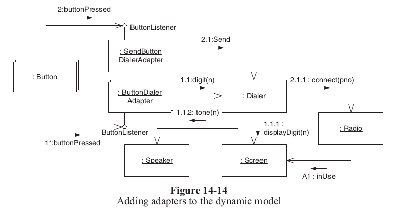
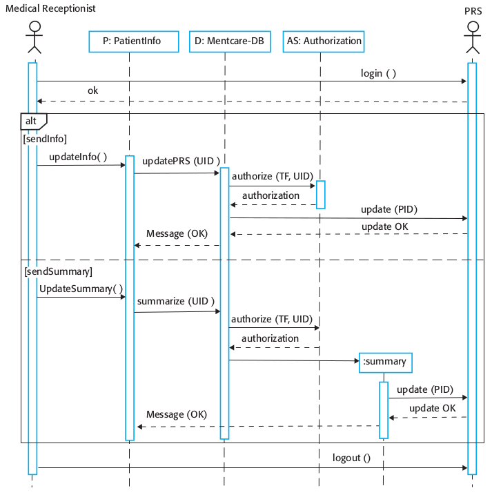

# Assignment #3

## C♯

Fork or clone repository.

### Kanban Board

[](https://commons.wikimedia.org/wiki/File:Simple-kanban-board-.jpg "Jeff.lasovski [CC BY-SA 3.0 (https://creativecommons.org/licenses/by-sa/3.0)], via Wikimedia Commons")

You are required to implement a model using Entity Framework Core for a simple kanban board for tracking work progress.

1. Install the required `Microsoft.EntityFrameworkCore` package.

1. Setup and configure your database host of choice.

1. Implement the following entities (*POCOs*) in the `Entities` project.

    - Task
        - Id : int
        - Title : string(100), required
        - AssignedTo : optional reference to *User* entity
        - Description : string(max), optional
        - State : enum (New, Active, Resolved, Closed, Removed), required
        - Tags : many-to-many reference to *Tag* entity
    - User
        - Id : int
        - Name : string(100), required
        - Email : string(100), required, unique
        - Tasks : list of *Task* entities belonging to *User*
    - Tag
        - Id : int
        - Name : string(50), required, unique
        - Tasks : many-to-many reference to *Task* entity

1. Ensure that the `State` property of the `Task` entity is stored as a `string`. See: <https://docs.microsoft.com/en-us/ef/core/modeling/value-conversions>.

1. Implement the `KanbanContext` required for the model above in the `Entities` project.

1. Implement and test the `ITagRepository` *and/or* the `IUserRepository` using the classes in the `Entities` project

1. Implement and test the `ITaskRepository` interface in the `Core` project using the `TaskRepository` class in the `Entities` project.

### Business Rules

#### 1. General

1. Trying to update or delete a non-existing entity should return `NotFound`.
1. *Create*, *Read*, and *Update* should return a proper `Response`.
1. Your are not allowed to write `throw new ...` - use the `Response` instead.
1. Your code must use an in-memory database for testing.
1. If a task, tag, or user is not found, return `null`.

#### 2. Task Repository

1. Only tasks with the state `New` can be deleted from the database.
1. Deleting a task which is `Active` should set its state to `Removed`.
1. Deleting a task which is `Resolved`, `Closed`, or `Removed` should return `Conflict`.
1. Creating a task will set its state to `New` and `Created`/`StateUpdated` to current time in UTC.
1. Create/update task must allow for editing tags.
1. Updating the `State` of a task will change the `StateUpdated` to current time in UTC.
1. Assigning a user which does not exist should return `BadRequest`.
1. TaskRepository may *not* depend on *TagRepository* or *UserRepository*.

#### 3. Tag Repository

1. Tags which are assigned to a task may only be deleted using the `force`.
1. Trying to delete a tag in use without the `force` should return `Conflict`.
1. Trying to create a tag which exists already should return `Conflict`.

#### 4. User Repository

1. Users who are assigned to a task may only be deleted using the `force`.
1. Trying to delete a user in use without the `force` should return `Conflict`.
1. Trying to create a user which exists already (same email) should return `Conflict`.

### Notes

Comparing actual time in a unit test can be tricky - `DateTime.UtcNow` is too precise - so setting a value in a test to compare with value in code will not work.

You will want to allow timing to be slightly off - maybe by 5 seconds as the following snippet demonstrates:

```csharp
var expected = DateTime.UtcNow;
var actual = DateTime.UtcNow.AddSeconds(2);

actual.Should().BeCloseTo(expected, precision: TimeSpan.FromSeconds(5)) // true

// or

Assert.Equal(expected, actual, precision: TimeSpan.FromSeconds(5)); // true
```

## Software Engineering

### Exercise 1

  * What level of detail should UML models have?
  * What is the difference between structural diagrams and behavioral diagrams in UML?
    - Provide two examples per category.


### Exercise 2

Draw a UML class diagram that models the following specifications:

  * A project has a name, a start date, and an end date.
  * A project is associated to a project manager, a name, a telephone, and a team.
  * A project manager manages (by starting and terminating) a project and leads a team that is associated with a project.
  * Projects receive as input requirements and produce a system. Both requirements and the system have a completion percentage and a description.
  * Each team is composed by developers.


### Exercise 3

Draw a UML state diagram that models your GitHub action configuration.
Include all triggers that you have defined.


### Exercise 4

Files that are under version control with Git (or that should be) are in one of the four states: `Untracked`, `Unmodified`, `Modified`, or `Staged`, see the respective [chapter in the Pro Git book](https://git-scm.com/book/en/v2/Git-Basics-Recording-Changes-to-the-Repository).
In that book, the authors provide a sequence diagram instead of a state diagram to illustrate states and state changes of a file, see the illustration below.


Draw a UML state diagram that illustrates the states of a single file that is version controlled with Git.
Let the state diagram start with cloning that file from a remote repository.

Use the git commands `clone`, `add` and `commit` together with file `edit`s as events that trigger state changes.
Can you also illustrate the actions that Git performs on these events with the help of the [chapter from the Pro Git book](https://git-scm.com/book/en/v2/Git-Basics-Recording-Changes-to-the-Repository)?


### Exercise 5

Translate the UML collaboration diagram (Fig. 14-14 from APPP), see below into a sequence diagram.




### Exercise 6


Draw a UML class diagram that models the structural information given in Fig. 5.7 from SE, see below



---

## Submitting the assignment

To submit the assignment you need to create a PDF document using LaTeX that contains the answers to the questions **and** a link to a public GitHub repository that contains a fork of the assignments repository with the completed code.

**Note**: You should not send a PR with your changes.

The PDF file must conform to the following naming convention: `group_<x>_<id1>_<id2>_<id3>_assignment_02.pdf`, where `<x>` is replaced by the number of your group from [README_GROUPS.md](./README_GROUPS.md) and `<id1>`, `<id2>`, and `<id3>` are your respective ITU identifiers. 

You submit via [LearnIT](https://learnit.itu.dk/mod/assign/view.php?id=164797).


